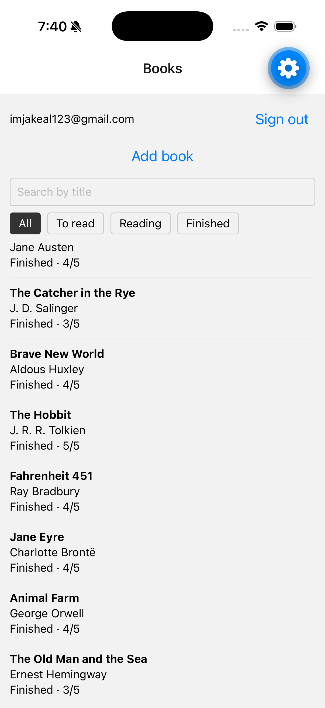
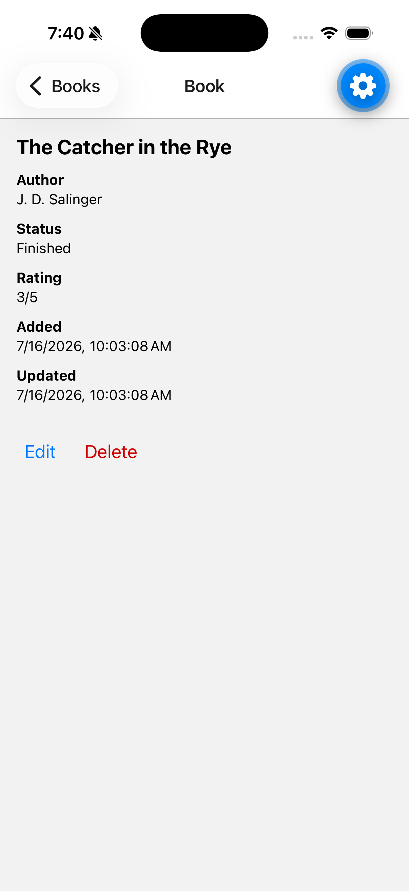
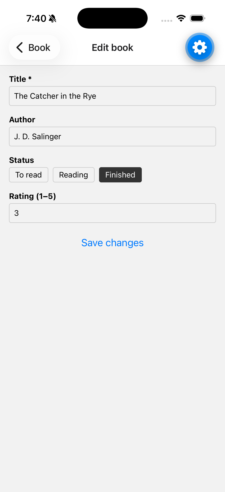
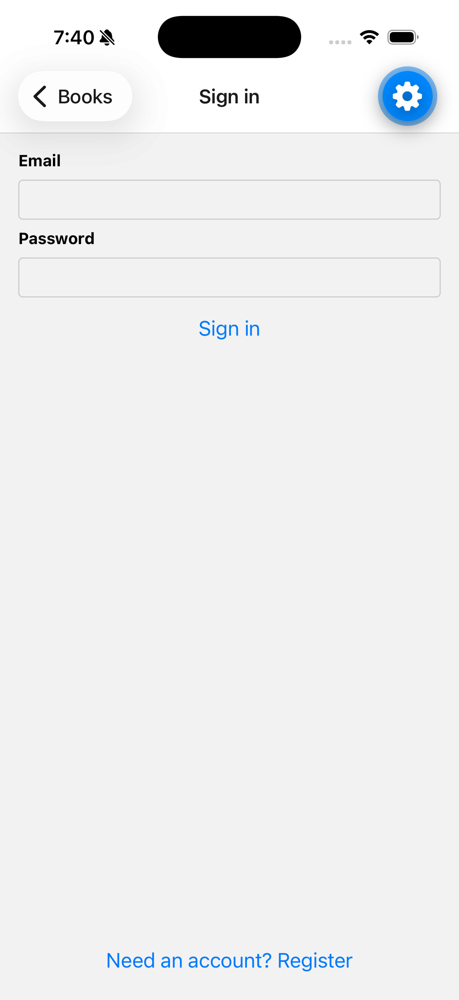

# Reading List

A small reading-list tracker: an Expo (React Native) app talking to a NestJS REST
API deployed on Vercel, backed by Supabase Postgres. Track books with a title,
optional author, status (`to_read` / `reading` / `finished`), and an optional
1–5 rating. Accounts are optional: anonymous users share one pool of books;
signing in scopes the list to your own books plus that shared pool.

**Live API:** `https://take-home-three-wine.vercel.app/`

## Repo structure

```
apps/
  api/       NestJS REST API (deployed to Vercel as a serverless function)
  mobile/    Expo app (React Navigation, no styling beyond structure)
supabase/
  schema.sql Database schema — the single source of truth, applied by hand
docs/
  PLAN.md    Implementation plan the work was committed against
```

## API surface

| Method   | Route                                   | Success                       | Errors                          |
| -------- | --------------------------------------- | ----------------------------- | ------------------------------- |
| `GET`    | `/books?search=&status=&limit=&offset=` | `200` page `{ items, total }` | `400` invalid filter/pagination |
| `GET`    | `/books/:id`                            | `200` item                    | `400` bad UUID, `404` not found |
| `POST`   | `/books`                                | `201` item                    | `400` invalid body              |
| `PATCH`  | `/books/:id`                            | `200` item                    | `400`, `404`                    |
| `DELETE` | `/books/:id`                            | `204`                         | `400` bad UUID, `404` not found |
| `POST`   | `/auth/register`                        | `201` session                 | `400` invalid body              |
| `POST`   | `/auth/login`                           | `200` session                 | `400`, `401` bad credentials    |
| `POST`   | `/auth/logout`                          | `204`                         | `401` missing/invalid token     |

Auth on `/books` is optional. A valid `Authorization: Bearer <access token>`
scopes every route to the caller's own books plus the shared anonymous pool; no
header scopes them to the pool alone (`user_id is null`). A header that is
present but malformed, invalid, or expired is a `401` — it is never silently
treated as anonymous. Pagination: `limit` defaults to 20 (max 50), `offset` max
10 000; a page past the end returns an empty `items` with the true `total`.

## Running it locally

Prerequisites: Node 20+, npm, a [Supabase](https://supabase.com) project
(free tier), and either a phone with Expo Go or an iOS/Android simulator.

### 1. Supabase

1. Create a Supabase project.
2. Open the SQL editor and run the contents of [`supabase/schema.sql`](supabase/schema.sql).
   The script drops and recreates the `books` table, so re-running it is also the
   "migration" story — demo data is disposable.
3. Under **Auth → Providers**, enable the **Email** provider with email
   confirmation **off** (deliberate demo trade-off — see below).

### 2. API

```bash
cd apps/api
npm install
cp .env.example .env   # fill in SUPABASE_URL and SUPABASE_SERVICE_ROLE_KEY from the dashboard
npm run start:dev      # serves on http://localhost:3000
```

The API refuses to start if either env var is missing or malformed. `.env` is
gitignored — real credentials never live in tracked files.

### 3. Mobile app

```bash
cd apps/mobile
npm install
cp .env.example .env   # set EXPO_PUBLIC_API_URL
npx expo start         # then press i / a, or scan the QR code with Expo Go
```

For local development set `EXPO_PUBLIC_API_URL` to your machine's LAN IP
(e.g. `http://192.168.1.10:3000`) so a device or simulator can reach the API —
`localhost` on a phone points at the phone. For anything shared or demoed, use
the HTTPS Vercel URL. This variable is embedded in the app bundle and is not a
secret; no Supabase key ever appears in the mobile app in any form.

## Deployment

The API deploys to Vercel as a single serverless function
(`apps/api/api/index.ts` wraps the compiled Nest app and caches the bootstrap
across warm invocations; `vercel.json` rewrites all paths to it). Create a
Vercel project with root directory `apps/api` and set `SUPABASE_URL` and
`SUPABASE_SERVICE_ROLE_KEY` in the Vercel dashboard — they are never committed.

## Key decisions & trade-offs

- **Supabase JS client over an ORM** — one table doesn't justify migration
  tooling; the schema lives in one reviewed SQL file, applied via the SQL
  editor.
- **`fetch` + component state over React Query** — four screens with no shared
  cache needs. Optimistic updates get harder, which is acceptable here.
- **Simple token auth over full session management** — Supabase Auth proxied
  through the API (register/login/logout, Bearer token). Deliberately small: no
  email confirmation, no password reset, no silent refresh (a `401` clears the
  session and the app continues signed out; sessions last about an hour, fine
  for a demo).
- **Auth is optional by design** — anonymous users share one unowned pool
  rather than being locked out or given per-device identities. The pool stays
  visible (and writable) after signing in, since it was already writable by
  anyone without a token — hiding it would remove features without adding
  security.
- **Few targeted tests over coverage** — the budget went to input
  validation, error handling, and the ownership model.

## What I'd do next

- Rate limiting via `@nestjs/throttler` — `/auth/login` is a brute-force
  target.
- Silent token refresh: use the stored refresh token on a `401` before falling
  back to signed-out.
- A claim-on-signup flow linking a device's anonymous books to the new account
  (or per-device anonymous identity) instead of one shared pool.
- Optimistic delete in the list, and a small test suite over the books
  endpoints (validation failures, ownership scoping, error mapping).
- Per-user RLS policies if clients ever talk to Supabase directly — today the
  API is deliberately the only path in.

## Screenshots

| List — search, status filters, signed in                                                                              | Book detail                                                                                           |
| --------------------------------------------------------------------------------------------------------------------- | ----------------------------------------------------------------------------------------------------- |
|  |  |

| Edit form                                                                                | Sign in                                                                  |
| ---------------------------------------------------------------------------------------- | ------------------------------------------------------------------------ |
|  |  |
